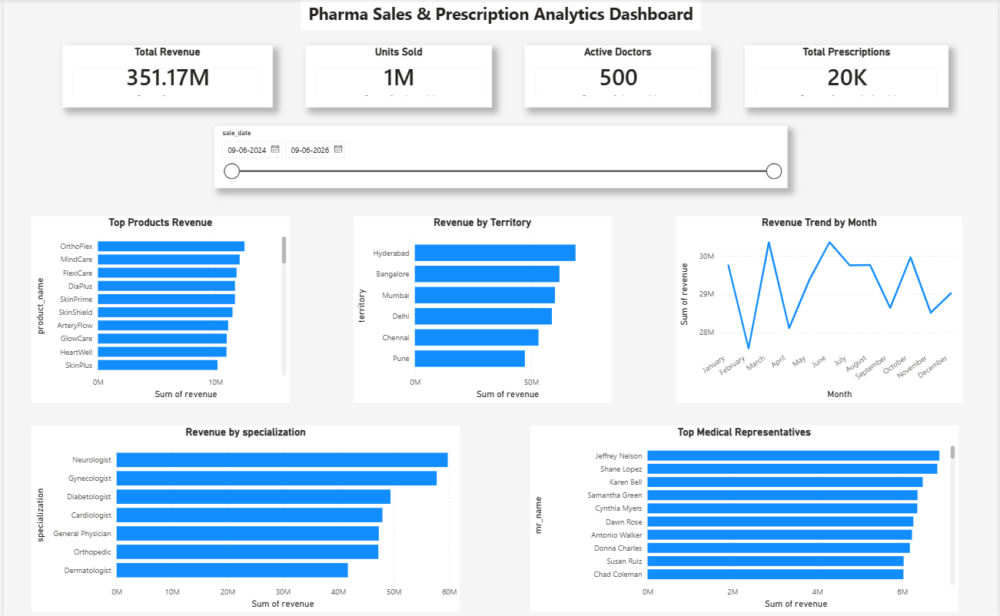

# Pharma Sales & Prescription Analytics Dashboard

## Project Overview

This project analyzes pharmaceutical sales and prescription data using SQL and Power BI. The objective is to identify revenue trends, top-performing products, territory performance, doctor specialization contributions, and medical representative performance through an interactive dashboard.

---

## Business Problem

Pharmaceutical companies require visibility into sales performance across products, territories, doctors, and sales teams. This project provides a centralized dashboard to monitor KPIs and support business decision-making.

---

## Tools & Technologies Used

* SQL
* SQLite
* Power BI
* DAX
* Excel

---

## Data Model

The project uses the following tables:

* Sales
* Products
* Doctors
* Medical Representatives
* Prescriptions

Relationships were created between tables to support cross-functional business analysis.

---

## Key Performance Indicators (KPIs)

* Total Revenue
* Units Sold
* Active Doctors
* Total Prescriptions

---

## Dashboard Features

### Sales Analysis

* Top Products by Revenue
* Revenue by Territory
* Monthly Revenue Trend

### Doctor Analysis

* Revenue by Specialization
* Active Doctor Tracking

### Sales Team Analysis

* Top Medical Representatives by Revenue

### Interactive Filters

* Date Range Slicer

---

## SQL Analysis Performed

* Revenue Analysis
* Product Performance Analysis
* Territory Performance Analysis
* Doctor Specialization Analysis
* Medical Representative Performance Analysis

---

## DAX Measures

```DAX
Total Revenue = SUM(sales[revenue])

Units Sold = SUM(sales[units_sold])

Active Doctors = DISTINCTCOUNT(doctors[doctor_id])

Total Prescriptions = COUNT(prescriptions[prescription_id])
```

## Key Insights

* OrthoFlex emerged as one of the top-performing products by revenue.
* Hyderabad generated the highest revenue among territories.
* Neurologists contributed the highest revenue among doctor specializations.
* Revenue patterns showed fluctuations across different months.
* Top-performing medical representatives contributed significantly to overall sales.

---

## Skills Demonstrated

* Data Cleaning
* SQL Querying
* Data Modeling
* DAX Calculations
* Dashboard Development
* Business Analysis
* Data Visualization
* KPI Design

---

## Dashboard Preview



---

## Project Outcome

Built an end-to-end Pharma Sales & Prescription Analytics solution by integrating SQL analysis, data modeling, and Power BI dashboarding to provide actionable business insights.
